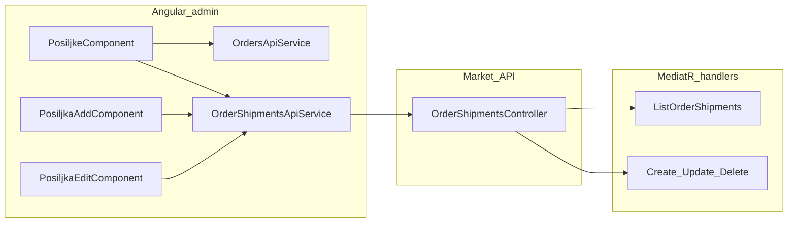

# Task 1 – OrderShipment (Pošiljke) CRUD plan

## Scope (from exam brief)

- **Backend:** CQRS commands/queries/handlers/validators + `OrderShipmentsController` (entity, EF, migrations, and seed already exist per [`OrderShipmentEntity.cs`](c:\Users\Administrator\Desktop\Angular Repos\Workshops\2026-02-16 - TEST\rs1_backend-2025-26\Market.Domain\Entities\Sales\OrderShipmentEntity.cs) and [`DynamicDataSeeder.cs`](c:\Users\Administrator\Desktop\Angular Repos\Workshops\2026-02-16 - TEST\rs1_backend-2025-26\Market.Infrastructure\Database\Seeders\DynamicDataSeeder.cs)).
- **List:** Columns already sketched in [`posiljke.component.html`](c:\Users\Administrator\Desktop\Angular Repos\Workshops\2026-02-16 - TEST\rs1-frontend-2025-26\src\app\modules\admin\posiljke\posiljke.component.html); add **order filter** dropdown (“Sve narudžbe” + orders), **server pagination** with correct totals when filtered, **edit/delete** actions, **toast** on success/error, **confirm modal** before delete.
- **Add/Edit:** **Reactive Forms** (required by exam), toasts on success/error.
- **Simplicity:** Prefer the smallest number of new files; reuse MediatR + FluentValidation registration already in [`DependencyInjection.cs`](c:\Users\Administrator\Desktop\Angular Repos\Workshops\2026-02-16 - TEST\rs1_backend-2025-26\Market.Application\DependencyInjection.cs) (`RegisterServicesFromAssembly` / `AddValidatorsFromAssembly`).
- **Design/CSS:** Keep existing [`posiljke.component.scss`](c:\Users\Administrator\Desktop\Angular Repos\Workshops\2026-02-16 - TEST\rs1-frontend-2025-26\src\app\modules\admin\posiljke\posiljke.component.scss); do not add new stylesheets unless you literally duplicate an existing empty/minimal pattern (default: **no new SCSS** for add/edit—use the same `container` / Material patterns as products only if needed for layout).

---

## Backend – what to add (mirror Products, not catalog cache)

**Primary template (copy shape, strip catalog concerns):** [`ProductsController.cs`](c:\Users\Administrator\Desktop\Angular Repos\Workshops\2026-02-16 - TEST\rs1_backend-2025-26\Market.API\Controllers\ProductsController.cs), [`ListProductsQuery*.cs`](c:\Users\Administrator\Desktop\Angular Repos\Workshops\2026-02-16 - TEST\rs1_backend-2025-26\Market.Application\Modules\Catalog\Products\Queries\List), [`GetProductByIdQuery*.cs`](c:\Users\Administrator\Desktop\Angular Repos\Workshops\2026-02-16 - TEST\rs1_backend-2025-26\Market.Application\Modules\Catalog\Products\Queries\GetById), [`CreateProductCommand*.cs`](c:\Users\Administrator\Desktop\Angular Repos\Workshops\2026-02-16 - TEST\rs1_backend-2025-26\Market.Application\Modules\Catalog\Products\Commands\Create), [`UpdateProductCommand*.cs`](c:\Users\Administrator\Desktop\Angular Repos\Workshops\2026-02-16 - TEST\rs1_backend-2025-26\Market.Application\Modules\Catalog\Products\Commands\Update), [`DeleteProductCommand*.cs`](c:\Users\Administrator\Desktop\Angular Repos\Workshops\2026-02-16 - TEST\rs1_backend-2025-26\Market.Application\Modules\Catalog\Products\Commands\Delete).

**New module folder (exam-aligned):** `Market.Application/Modules/Sales/OrderShipments/` with:

| Area | Files / behavior |
|------|------------------|
| **List** | `ListOrderShipmentsQuery` extends [`BasePagedQuery<T>`](c:\Users\Administrator\Desktop\Angular Repos\Workshops\2026-02-16 - TEST\rs1_backend-2025-26\Market.Application\Common\BasePagedQuery.cs); add **`int? OrderId`** (when null/absent → no filter). Handler: `ctx.OrderShipments.AsNoTracking()`, optional `Where(x => x.OrderId == request.OrderId)`, `Include`/projection join to `Order` for **reference number**; `OrderBy` e.g. `ShipmentNumber`; project to DTO; return [`PageResult<T>.FromQueryableAsync`](c:\Users\Administrator\Desktop\Angular Repos\Workshops\2026-02-16 - TEST\rs1_backend-2025-26\Market.Application\Common\PageResult.cs) so **filtered count drives `totalPages`**. |
| **GetById** | Same pattern as [`GetProductByIdQueryHandler.cs`](c:\Users\Administrator\Desktop\Angular Repos\Workshops\2026-02-16 - TEST\rs1_backend-2025-26\Market.Application\Modules\Catalog\Products\Queries\GetById\GetProductByIdQueryHandler.cs); throw `MarketNotFoundException` if missing. |
| **Create** | `CreateOrderShipmentCommand : IRequest<int>` with properties matching entity fields; handler: validate `OrderId` exists (`Orders` DbSet), insert `OrderShipmentEntity`, `SaveChanges`; return id. **No** `ICatalogCacheVersionService` (Products-specific). |
| **Update** | `UpdateOrderShipmentCommand` with `Id` + editable fields; handler loads tracked or explicit update; validate FK; `SaveChanges`. |
| **Delete** | `DeleteOrderShipmentCommand` + handler: load or `MarketNotFoundException`, `Remove`, `SaveChanges`. Optional: mirror admin check from [`DeleteProductCommandHandler.cs`](c:\Users\Administrator\Desktop\Angular Repos\Workshops\2026-02-16 - TEST\rs1_backend-2025-26\Market.Application\Modules\Catalog\Products\Commands\Delete\DeleteProductCommandHandler.cs) only if you need parity—simplest is **delete if found** (still 404 if missing). |
| **Validators** | `AbstractValidator` classes like [`CreateProductCommandValidator.cs`](c:\Users\Administrator\Desktop\Angular Repos\Workshops\2026-02-16 - TEST\rs1_backend-2025-26\Market.Application\Modules\Catalog\Products\Commands\Create\CreateProductCommandValidator.cs): not empty `ShipmentNumber` with max length from `OrderShipmentEntity.Constraints.ShipmentNumberMaxLength`, sensible rules for `ShippingCost`, `OrderId > 0`, enum in range, dates (e.g. delivered optional). |

**Controller:** New [`OrderShipmentsController`](c:\Users\Administrator\Desktop\Angular Repos\Workshops\2026-02-16 - TEST\rs1_backend-2025-26\Market.API\Controllers) – same routes as Products: `POST /`, `PUT /{id}`, `DELETE /{id}`, `GET /{id}`, `GET /` with `[FromQuery] ListOrderShipmentsQuery`. **Authorization:** simplest consistent admin surface = **`[Authorize(Policy = "Staff")]` on the controller class** (same policy as mutating endpoints in [`ProductsController.cs`](c:\Users\Administrator\Desktop\Angular Repos\Workshops\2026-02-16 - TEST\rs1_backend-2025-26\Market.API\Controllers\ProductsController.cs)); adjust only if your app’s global auth already forces staff on `/admin` API calls.

**DTO fields for list (match UI + task text):** `id`, `shipmentNumber`, `orderReferenceNumber` (from `Order.ReferenceNumber`), `status` (enum as int), `shippingCost`, `shippedAtUtc`, `deliveredAtUtc` (nullable). Status **display text** can be either a small helper on the server in the projection or a **tiny** client map (simplest: **client** map from [`OrderShipmentStatusType`](c:\Users\Administrator\Desktop\Angular Repos\Workshops\2026-02-16 - TEST\rs1_backend-2025-26\Market.Domain\Entities\Sales\OrderShipmentStatusType.cs) to Bosnian labels to avoid extra DTO property).

---

## Frontend – what to add (recycle Products + Orders)

**New API layer (copy Products API verbatim in structure):**

- Template: [`products-api.service.ts`](c:\Users\Administrator\Desktop\Angular Repos\Workshops\2026-02-16 - TEST\rs1-frontend-2025-26\src\app\api-services\products\products-api.service.ts) and [`products-api.models.ts`](c:\Users\Administrator\Desktop\Angular Repos\Workshops\2026-02-16 - TEST\rs1-frontend-2025-26\src\app\api-services\products\products-api.models.ts).
- Add folder `src/app/api-services/order-shipments/` with `order-shipments-api.service.ts` + `order-shipments-api.models.ts`: `ListOrderShipmentsRequest extends BasePagedQuery` with optional `orderId`, types for list row, get-by-id, create/update commands, `PageResult` alias – same naming style as products.

**List page – [`PosiljkeComponent`](c:\Users\Administrator\Desktop\Angular Repos\Workshops\2026-02-16 - TEST\rs1-frontend-2025-26\src\app\modules\admin\posiljke\posiljke.component.ts):**

- Extend **[`BaseListPagedComponent`](c:\Users\Administrator\Desktop\Angular Repos\Workshops\2026-02-16 - TEST\rs1-frontend-2025-26\src\app\core\components\base-classes\base-list-paged-component.ts)** exactly like [`products.component.ts`](c:\Users\Administrator\Desktop\Angular Repos\Workshops\2026-02-16 - TEST\rs1-frontend-2025-26\src\app\modules\admin\catalogs\products\products.component.ts): `request = new ListOrderShipmentsRequest()`, `initList()` in `ngOnInit`, `loadPagedData()` calls new API, `handlePageResult`.
- **Orders dropdown:** inject [`OrdersApiService`](c:\Users\Administrator\Desktop\Angular Repos\Workshops\2026-02-16 - TEST\rs1-frontend-2025-26\src\app\api-services\orders\orders-api.service.ts); load with **`allItemsPaging`** from [`paging-utils.ts`](c:\Users\Administrator\Desktop\Angular Repos\Workshops\2026-02-16 - TEST\rs1-frontend-2025-26\src\app\core\models\paging\paging-utils.ts) (same idea as products-add loading categories with [`largePaging`](c:\Users\Administrator\Desktop\Angular Repos\Workshops\2026-02-16 - TEST\rs1-frontend-2025-26\src\app\modules\admin\catalogs\products\products-add\products-add.component.ts)).
- **Filter behavior:** bind `mat-select` to `orderId: number | null`; on change set `request.orderId`, **`request.paging.page = 1`**, call `loadPagedData()`. For “Sve narudžbe”, set `orderId` to `null` and **omit** `orderId` from HTTP params (already how [`buildHttpParams`](c:\Users\Administrator\Desktop\Angular Repos\Workshops\2026-02-16 - TEST\rs1-frontend-2025-26\src\app\core\models\build-http-params.ts) skips null).
- **Pagination UI:** reuse **`<app-fit-paginator-bar [vm]="this" />`** from [`products.component.html`](c:\Users\Administrator\Desktop\Angular Repos\Workshops\2026-02-16 - TEST\rs1-frontend-2025-26\src\app\modules\admin\catalogs\products\products.component.html) (declared in Shared module).
- **Delete:** use [`DialogHelperService.confirmDelete`](c:\Users\Administrator\Desktop\Angular Repos\Workshops\2026-02-16 - TEST\rs1-frontend-2025-26\src\app\modules\shared\services\dialog-helper.service.ts) with shipment number as `itemName` (same flow as `products.component.ts` but **after success show `ToasterService.success`** instead of/in addition to a success dialog—exam text asks for **toast** on every success; optional one-line toast is enough).
- **Formatting:** use Angular `date` pipe `dd.MM.yyyy` for UTC strings; `number:'1.1-1'` (or `1.0-1`) for **one decimal** shipping cost per exam.
- **Navigation:** `onCreate()` → `router.navigate(['/admin/posiljke/add'])`; edit → `['/admin/posiljke', id, 'edit']` (routes already in [`admin-routing-module.ts`](c:\Users\Administrator\Desktop\Angular Repos\Workshops\2026-02-16 - TEST\rs1-frontend-2025-26\src\app\modules\admin\admin-routing-module.ts)).

**Add / Edit – recycle form patterns:**

- **Structure:** Follow [`products-add.component.ts`](c:\Users\Administrator\Desktop\Angular Repos\Workshops\2026-02-16 - TEST\rs1-frontend-2025-26\src\app\modules\admin\catalogs\products\products-add\products-add.component.ts) / [`products-edit.component.ts`](c:\Users\Administrator\Desktop\Angular Repos\Workshops\2026-02-16 - TEST\rs1-frontend-2025-26\src\app\modules\admin\catalogs\products\products-edit\products-edit.component.ts) + **[`BaseFormComponent`](c:\Users\Administrator\Desktop\Angular Repos\Workshops\2026-02-16 - TEST\rs1-frontend-2025-26\src\app\core\components\base-classes\base-form-component.ts)** for `initForm`, `onSubmit`, `hasError`.
- **Simplicity trade-off:** To avoid an extra `*FormService` file like [`product-form.service.ts`](c:\Users\Administrator\Desktop\Angular Repos\Workshops\2026-02-16 - TEST\rs1-frontend-2025-26\src\app\modules\admin\catalogs\products\services\product-form.service.ts), build the `FormGroup` with **`FormBuilder` inside add/edit components** (same spirit as [`uplata-add.component.ts`](c:\Users\Administrator\Desktop\Angular Repos\Workshops\2026-02-16 - TEST\rs1-frontend-2025-26\src\app\modules\admin\uplate\uplata-add\uplata-add.component.ts) but with validators on each control).
- **Controls:** `shipmentNumber`, `orderId`, `status` (numeric enum aligned with backend), `shippingCost`, `shippedAtUtc`, `deliveredAtUtc` (optional). Use **`mat-select`** for order + status; number input for cost; for datetimes use the **simplest** input that works with your API (e.g. `datetime-local` + small parse/format helpers in the component, or plain text + ISO on submit—keep helpers **private methods in the same file**).
- **Toasts:** inject [`ToasterService`](c:\Users\Administrator\Desktop\Angular Repos\Workshops\2026-02-16 - TEST\rs1-frontend-2025-26\src\app\core\services\toaster.service.ts) on create/update/load errors like products-add.

**HTML for add/edit:** Start from [`products-add.component.html`](c:\Users\Administrator\Desktop\Angular Repos\Workshops\2026-02-16 - TEST\rs1-frontend-2025-26\src\app\modules\admin\catalogs\products\products-add\products-add.component.html) structure (`container`, `form` + `[formGroup]`, `mat-form-field` outline) but **replace translate pipes with plain Croatian labels** to avoid new i18n keys (fastest for exam).

**Module:** [`admin-module.ts`](c:\Users\Administrator\Desktop\Angular Repos\Workshops\2026-02-16 - TEST\rs1-frontend-2025-26\src\app\modules\admin\admin-module.ts) already declares add/edit/list – **no module changes** unless you add a standalone pipe/helper (prefer inline status map in `posiljke.component.ts` or a **single** `order-shipment-status.helper.ts` copied from [`order-status.helper.ts`](c:\Users\Administrator\Desktop\Angular Repos\Workshops\2026-02-16 - TEST\rs1-frontend-2025-26\src\app\api-services\orders\order-status.helper.ts) style if you want zero clutter in the component).

---

## Data flow (high level)

---

## “Copied from where” checklist (for your notes / exam)

| What you build | Copy from |
|----------------|-----------|
| CQRS file layout + controller routes | Products module + [`ProductsController`](c:\Users\Administrator\Desktop\Angular Repos\Workshops\2026-02-16 - TEST\rs1_backend-2025-26\Market.API\Controllers\ProductsController.cs) |
| Paged list + total count | [`ListProductsQueryHandler`](c:\Users\Administrator\Desktop\Angular Repos\Workshops\2026-02-16 - TEST\rs1_backend-2025-26\Market.Application\Modules\Catalog\Products\Queries\List\ListProductsQueryHandler.cs) + optional filter idea from [`ListOrdersQueryHandler`](c:\Users\Administrator\Desktop\Angular Repos\Workshops\2026-02-16 - TEST\rs1_backend-2025-26\Market.Application\Modules\Sales\Orders\Queries\List\ListOrdersQueryHandler.cs) |
| FluentValidation | [`CreateProductCommandValidator`](c:\Users\Administrator\Desktop\Angular Repos\Workshops\2026-02-16 - TEST\rs1_backend-2025-26\Market.Application\Modules\Catalog\Products\Commands\Create\CreateProductCommandValidator.cs) |
| Angular HTTP service + models | [`products-api.service.ts`](c:\Users\Administrator\Desktop\Angular Repos\Workshops\2026-02-16 - TEST\rs1-frontend-2025-26\src\app\api-services\products\products-api.service.ts) / [`products-api.models.ts`](c:\Users\Administrator\Desktop\Angular Repos\Workshops\2026-02-16 - TEST\rs1-frontend-2025-26\src\app\api-services\products\products-api.models.ts) |
| List + pagination + delete wiring | [`products.component.ts`](c:\Users\Administrator\Desktop\Angular Repos\Workshops\2026-02-16 - TEST\rs1-frontend-2025-26\src\app\modules\admin\catalogs\products\products.component.ts) / [`products.component.html`](c:\Users\Administrator\Desktop\Angular Repos\Workshops\2026-02-16 - TEST\rs1-frontend-2025-26\src\app\modules\admin\catalogs\products\products.component.html) |
| Load all orders for dropdown | [`products-add.component.ts`](c:\Users\Administrator\Desktop\Angular Repos\Workshops\2026-02-16 - TEST\rs1-frontend-2025-26\src\app\modules\admin\catalogs\products\products-add\products-add.component.ts) pattern (`list` + paging util) + [`OrdersApiService`](c:\Users\Administrator\Desktop\Angular Repos\Workshops\2026-02-16 - TEST\rs1-frontend-2025-26\src\app\api-services\orders\orders-api.service.ts) |
| Reactive add/edit + submit | [`products-add`](c:\Users\Administrator\Desktop\Angular Repos\Workshops\2026-02-16 - TEST\rs1-frontend-2025-26\src\app\modules\admin\catalogs\products\products-add\products-add.component.ts) / [`products-edit`](c:\Users\Administrator\Desktop\Angular Repos\Workshops\2026-02-16 - TEST\rs1-frontend-2025-26\src\app\modules\admin\catalogs\products\products-edit\products-edit.component.ts) + [`BaseFormComponent`](c:\Users\Administrator\Desktop\Angular Repos\Workshops\2026-02-16 - TEST\rs1-frontend-2025-26\src\app\core\components\base-classes\base-form-component.ts) |

---

## Verification (after implementation)

- Run API + Angular per exam instructions (`npm install`, `npm start` in **cmd** for frontend).
- **List:** Filter “all” vs specific order; change page size; confirm `totalItems` / pages change when filtered.
- **CRUD:** Create → appears in list; edit → persists; delete → confirm modal then removed.
- **Rules:** Reactive forms on add/edit; toast on each success/error path; pagination always from API.
