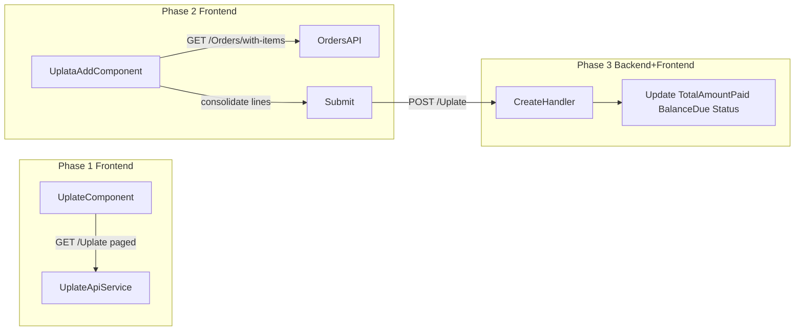
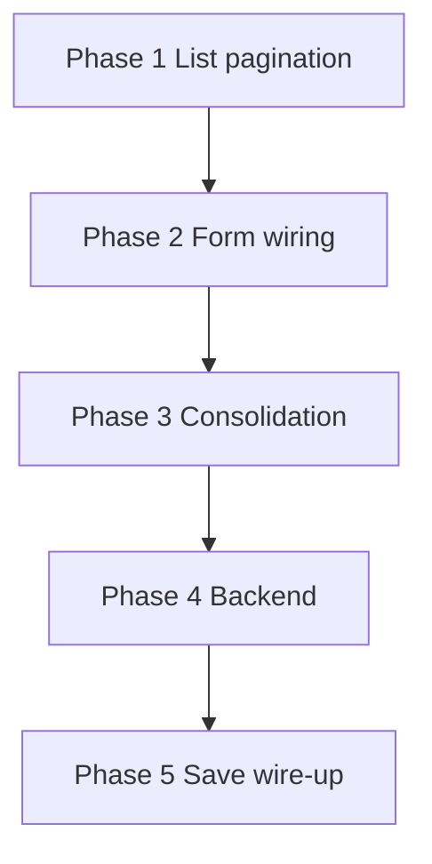

# Uplata Exam — Phased Implementation Plan

## Current state

| Layer | Done | Missing |
|-------|------|---------|
| **List** | Table UI, `GET /Uplate`, seed data (3 rows) | Real pagination on frontend |
| **Add form** | Layout + `FormArray` shell | `formControlName`, API load, enum options, save |
| **Backend** | `UplataEntity` (flat), `ListUplateQuery` | `UplataLinijaEntity`, `POST`, order balance/status update |

Routes and nav already exist: `/admin/uplate`, `/admin/uplate/add` in [`admin-routing-module.ts`](rs1-frontend-2025-26/src/app/modules/admin/admin-routing-module.ts).



---

## Copy-paste map (your rule #1)

| What you need | Copy from | Path |
|---------------|-----------|------|
| Paginated list + loading | `PosiljkeComponent` | [`posiljke.component.ts`](rs1-frontend-2025-26/src/app/modules/admin/posiljke/posiljke.component.ts) — drop filter/actions columns |
| Paginator UI | `PosiljkeComponent` HTML | [`posiljke.component.html`](rs1-frontend-2025-26/src/app/modules/admin/posiljke/posiljke.component.html) — `<app-fit-paginator-bar [vm]="this">` |
| Base paging class | `BaseListPagedComponent` | [`base-list-paged-component.ts`](rs1-frontend-2025-26/src/app/core/components/base-classes/base-list-paged-component.ts) |
| `formControlName` wiring | `FakturaAddComponent` HTML | [`faktura-add.component.html`](rs1-frontend-2025-26/src/app/modules/admin/catalogs/fakture/faktura-add/faktura-add.component.html) |
| Enum dropdown (`tipovi` pattern) | `FakturaAddComponent` TS | [`faktura-add.component.ts`](rs1-frontend-2025-26/src/app/modules/admin/catalogs/fakture/faktura-add/faktura-add.component.ts) → `nacinPlacanjaOptions` |
| Load orders dropdown | `PosiljkaAddComponent.loadOrders()` | [`posiljka-add.component.ts`](rs1-frontend-2025-26/src/app/modules/admin/posiljke/posiljka-add/posiljka-add.component.ts) — use `listWithItems` instead of `list` |
| Save + toast + navigate | `PosiljkaAddComponent.save()` | same file |
| API `create()` | `OrderShipmentsApiService` | [`order-shipments-api.service.ts`](rs1-frontend-2025-26/src/app/api-services/order-shipments/order-shipments-api.service.ts) |
| Command DTO (frontend) | `CreateOrderShipmentsCommand` interface | [`order-shipments-api.model.ts`](rs1-frontend-2025-26/src/app/api-services/order-shipments/order-shipments-api.model.ts) |
| Child entity | `OrderItemEntity` | [`OrderItemEntity.cs`](rs1_backend-2025-26/Market.Domain/Entities/Sales/OrderItemEntity.cs) — simplified fields |
| EF 1:N config | `OrderItemConfiguration` | [`OrderItemConfiguration.cs`](rs1_backend-2025-26/Market.Infrastructure/Database/Configurations/Sales/OrderItemConfiguration.cs) |
| Create handler (lines loop) | `CreateOrderCommandHandler` | [`CreateOrderCommandHandler.cs`](rs1_backend-2025-26/Market.Application/Modules/Sales/Orders/Commands/Create/CreateOrderCommandHandler.cs) |
| Create handler (header + FK check) | `CreateOrderShipmentsCommandHandler` | [`CreateOrderShipmentsCommandHandler.cs`](rs1_backend-2025-26/Market.Application/Modules/Sales/OrdersShipment/Commands/Create/CreateOrderShipmentsCommandHandler.cs) |
| Controller POST | `OrderShipmentsController.Create` | [`OrderShipmentsController.cs`](rs1_backend-2025-26/Market.API/Controllers/OrderShipmentsController.cs) |

**No copy source exists for:** line consolidation (same product + same payment method → sum quantities). Write ~10 lines inline in `onSubmit` (rule #2).

---

## Phase 1 — Paginated list (frontend only)

**Goal:** Exam table with working pagination; no edit/delete columns (already correct).

**Files:** [`uplate.component.ts`](rs1-frontend-2025-26/src/app/modules/admin/uplate/uplate.component.ts), [`uplate.component.html`](rs1-frontend-2025-26/src/app/modules/admin/uplate/uplate.component.html), [`uplate-api.models.ts`](rs1-frontend-2025-26/src/app/api-services/uplate/uplate-api.models.ts), [`uplate-api.service.ts`](rs1-frontend-2025-26/src/app/api-services/uplate/uplate-api.service.ts)

**Steps:**
1. Add `ListUplateRequest extends BasePagedQuery` (copy structure from [`ListOrderShipmentsRequest`](rs1-frontend-2025-26/src/app/api-services/order-shipments/order-shipments-api.model.ts) — no extra filters).
2. Change `UplateComponent` to extend `BaseListPagedComponent<ListUplateQueryDto, ListUplateRequest>` (copy `PosiljkeComponent` `loadPagedData`, `ngOnInit` → `initList()`).
3. Update service `list(request)` to use `buildHttpParams` (copy from order-shipments service).
4. Bind table to `items` instead of `uplate`; add paginator bar to HTML (copy from posiljke).
5. Replace `console.error` with `toaster.error` (copy toast pattern from posiljke).

**Test without backend changes:** Backend `ListUplateQueryHandler` already paginates — seeded 3 rows appear with page size 10.

---

## Phase 2 — Add form wiring (frontend only)

**Goal:** Fully working reactive form UI; orders loaded from API; product dropdown filtered by order.

**Files:** [`uplata-add.component.ts`](rs1-frontend-2025-26/src/app/modules/admin/uplate/uplata-add/uplata-add.component.ts), [`uplata-add.component.html`](rs1-frontend-2025-26/src/app/modules/admin/uplate/uplata-add/uplata-add.component.html)

**Steps:**
1. **HTML** — add missing `formControlName` on all inputs/selects (copy from faktura-add):
   - `brojUplate`, `orderId`, `napomena`
   - per row: `productId`, `kolicina`, `nacinPlacanja`
2. **Validators** — add `Validators.required` on mandatory fields (minimal, copy style from faktura-add / order-edit).
3. **Load orders** in `ngOnInit`:
   ```typescript
   this.ordersApi.listWithItems({ paging: largePaging }).subscribe(...)
   ```
   Copy from `posiljka-add.loadOrders()` but swap to `listWithItems` + `largePaging` from [`paging-utils.ts`](rs1-frontend-2025-26/src/app/core/models/paging/paging-utils.ts).
4. **Payment method dropdown** — add options (copy `tipovi` from faktura-add):
   ```typescript
   nacinPlacanjaOptions = [
     { id: NacinPlacanjaType.Kes, name: 'Keš' },
     { id: NacinPlacanjaType.Kartica, name: 'Kartica' }
   ];
   ```
5. **Product binding fix** — API returns `product.productId` / `product.productName` (backend DTO), not `product.id` / `product.name`. Update `mat-option` `[value]` and display text accordingly (check Network tab if unsure).
6. **`onOrderChange`** — clear `items` FormArray when order changes (optional, comment if you skip).

**Test:** Form fills, order dropdown populates, products filter per order. Save button still no-op.

---

## Phase 3 — Consolidation + submit prep (frontend only)

**Goal:** Exam business rule on lines before API call.

**Rule (from exam):**
- Same `productId` + same `nacinPlacanja` → **one line**, quantities summed.
- Same product, different payment method → **separate lines**.

**New code** in `uplata-add.component.ts` (no existing copy):

```typescript
private consolidateLines(raw: { productId: number; kolicina: number; nacinPlacanja: number }[]) {
  const map = new Map<string, typeof raw[0]>();
  for (const line of raw) {
    const key = `${line.productId}-${line.nacinPlacanja}`;
    const existing = map.get(key);
    if (existing) existing.kolicina += line.kolicina;
    else map.set(key, { ...line });
  }
  return [...map.values()];
}
```

Call from `onSubmit` after `form.valid` check, before building command.

**Optional (commented, rule #2):** validate `kolicina` ≤ order item quantity — not required for exam pass.

---

## Phase 4 — Backend create (needed for save)

**Goal:** `POST /Uplate` creates payment + lines; updates order `TotalAmountPaid`, `BalanceDue`, `Status`.

### 4a. Domain + EF

| File | Action |
|------|--------|
| New `UplataLinijaEntity.cs` | Copy slim `OrderItemEntity`: `UplataId`, `ProductId`, `Kolicina`, `NacinPlacanja` |
| [`UplataEntity.cs`](rs1_backend-2025-26/Market.Domain/Entities/Sales/UplataEntity.cs) | Add `ICollection<UplataLinijaEntity> Linije` |
| New `UplataLinijaConfiguration.cs` | Copy `OrderItemConfiguration` — Cascade delete from Uplata |
| [`DatabaseContext.cs`](rs1_backend-2025-26/Market.Infrastructure/Database/DatabaseContext.cs) | `DbSet<UplataLinijaEntity>` |
| [`IAppDbContext.cs`](rs1_backend-2025-26/Market.Application/Abstractions/IAppDbContext.cs) | Same |

Run migration: `dotnet ef migrations add AddUplataLinija -p Market.Infrastructure -s Market.API`

### 4b. CQRS Create (copy Order create + Shipment create)

New folder: `Market.Application/Modules/Sales/Uplate/Commands/Create/`

- **`CreateUplataCommand`** — `BrojUplate`, `OrderId`, `Napomena?`, `Items[]` with `ProductId`, `Kolicina`, `NacinPlacanja`
- **`CreateUplataCommandHandler`** — logic:
  1. Load order (copy FK check from `CreateOrderShipmentsCommandHandler`)
  2. Create `UplataEntity`, loop items → `UplataLinijaEntity` (copy loop from `CreateOrderCommandHandler`)
  3. **UkupanIznos** = sum of `product.Price * kolicina` per line (exam: base price, no discounts)
  4. Update order:
     - `TotalAmountPaid += UkupanIznos`
     - `BalanceDue = TotalAmount - TotalAmountPaid`
     - `Status = BalanceDue == 0 ? Paid : PartiallyPaid` ([`OrderStatusType`](rs1_backend-2025-26/Market.Domain/Entities/Sales/OrderStatusType.cs))
  5. `SaveChangesAsync`
- **`CreateUplataCommandValidator`** — optional minimal: required fields, `Items.Count >= 1` (copy validator style from `CreateOrderShipmentsCommandValidator` if you want)

### 4c. API

[`UplateController.cs`](rs1_backend-2025-26/Market.API/Controllers/UplateController.cs) — add `[HttpPost]` (copy `OrderShipmentsController.Create`).

---

## Phase 5 — Wire save end-to-end (backend + frontend)

**Files:** [`uplate-api.models.ts`](rs1-frontend-2025-26/src/app/api-services/uplate/uplate-api.models.ts), [`uplate-api.service.ts`](rs1-frontend-2025-26/src/app/api-services/uplate/uplate-api.service.ts), [`uplata-add.component.ts`](rs1-frontend-2025-26/src/app/modules/admin/uplate/uplata-add/uplata-add.component.ts)

1. Add `CreateUplataCommand` / line interface (copy from `CreateOrderShipmentsCommand`).
2. Add `create(command)` to service (copy `OrderShipmentsApiService.create`).
3. Finish `onSubmit()` (copy `PosiljkaAddComponent.save()`):
   - `markAllAsTouched()` if invalid
   - `consolidateLines(form.value.items)`
   - `api.create({ brojUplate, orderId, napomena, items })`
   - `toaster.success` → navigate `/admin/uplate`
   - `toaster.error` on failure

**Test flow:** Create payment with 2 lines (same product + same method) → verify 1 line saved; check order status in DB or Orders list.

---

## What we intentionally skip (exam scope)

- Edit/delete columns on list (exam says no)
- Delete confirmation modal for uplate (not in task)
- `BaseFormComponent` / separate form service (posiljka uses them; uplata scaffold is simpler — stay inline like `faktura-add` unless you prefer posiljka style)
- Backend consolidation (frontend already merges before POST)
- Quantity-cap validation (optional commented code only)
- Updating seed data with lines (exam says `UkupanIznos` is calculated in seed for list testing only)

---

## Suggested work order for exam points



Phases 1–3 are **frontend-only** and testable immediately. Phase 4+5 must be done together for a working save.

**Startup reminder:** `npm install && npm start` (frontend), run API + apply migration before testing create.
